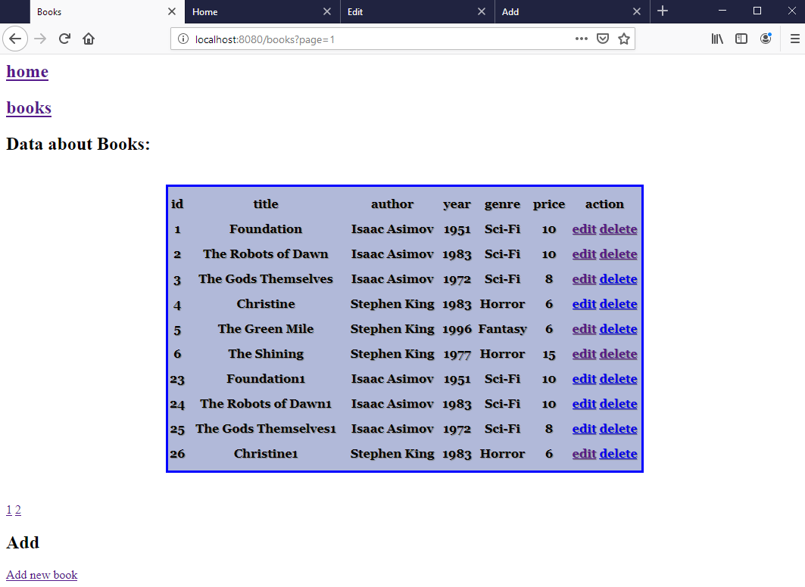

# Crud-maven-spring-hibernate

A simple CRUD application on Maven with Spring MVC and Hibernate ORM.

## Built With

* [Apache Maven](https://maven.apache.org) Dependency Management
* [Spring](https://spring.io/)  Application framework and inversion of control container for the Java platform
* [Hibernate ORM](https://hibernate.org) Framework for mapping an object-oriented domain model to a relational database.
* [Apache Tomcat](http://tomcat.apache.org/) "Tomcat Server"
* [MySQL](https://www.mysql.com) Open-source relational database management system
* [IntelliJ IDEA](https://www.jetbrains.com/) Java development environment 

## Details

* For details about connection to the database check db.properties in /resources/
* To deploy through with Maven only web.xml must be configured from the scratch. In this project war package works straight with a Tomcat.

## Usage

* Run the project through the IDE and head out to http://localhost:8080
* IDE should be configured with Tomcat

#

